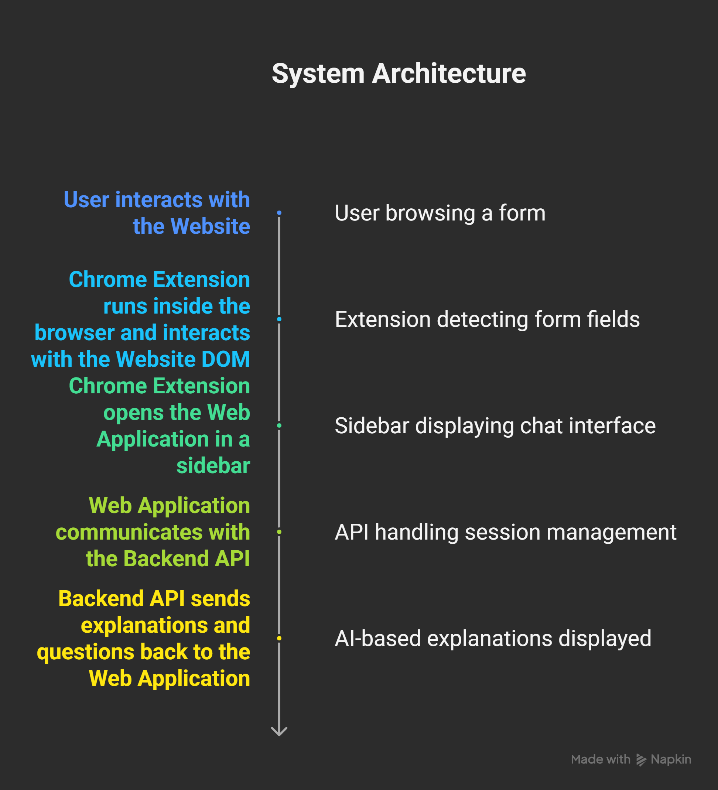
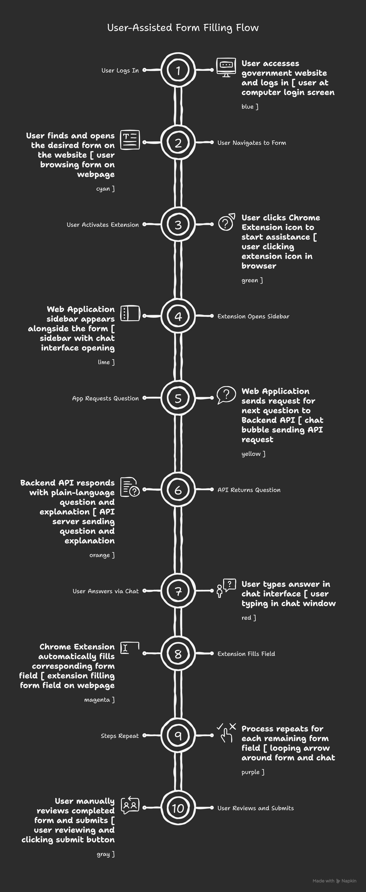

# System Architecture Design

## Purpose of This Document

This document explains the architectural design of Bureaucracy Breaker and the reasoning behind key structural decisions.

The architecture was planned before implementation to ensure:
- Clear separation of responsibilities
- Compliance with browser and security constraints
- Reliable behavior during form assistance
- Feasibility within hackathon time limits

---

## High-Level Architecture Overview

Bureaucracy Breaker follows a **three-layer assistive architecture**:

1. Browser Extension  
2. Web Application (UI Layer)  
3. Backend API (Logic + AI Layer)

Each layer has strict boundaries and does not perform responsibilities assigned to another layer.

---

## High-Level Architecture Diagram

This diagram illustrates how the browser extension, web application, and backend interact with each other while keeping the user in control.

---

## Component Breakdown

### 1. Browser Extension (Client-Side Assistance Layer)

**Role:**  
Assist the user inside their own browser without bypassing security mechanisms.

**Responsibilities:**
- Detect form fields on live web pages
- Inject a contextual button or sidebar
- Highlight active fields
- Autofill inputs using user-provided answers
- Pass form metadata to the web application

**Explicit Constraints:**
- No automatic login
- No CAPTCHA reading or solving
- No automatic submission
- No AI calls
- No credential storage

The extension operates only at the **DOM level**, similar to autofill or accessibility tools.

---

### 2. Web Application (Frontend / UI Layer)

**Role:**  
Provide a conversational interface that guides the user step by step.

**Responsibilities:**
- Display chat-style explanations and questions
- Collect user responses
- Forward answers to the backend
- Reflect backend instructions visually
- Indicate when all required fields are completed

**Design Principle:**  
The frontend does not understand form logic.  
It only renders responses generated by the backend.

---

### 3. Backend API (Logic + AI Layer)

**Role:**  
Act as the reasoning engine of the system.

**Responsibilities:**
- Maintain session state
- Decide the next field to handle
- Generate plain-language explanations
- Ask user-friendly questions
- Validate response formats
- Track completion status

**AI Usage:**
- AI is used only for explanation and reasoning
- AI never interacts with the browser DOM
- AI never submits forms or bypasses security

This keeps AI strictly assistive and predictable.

---

## Session-Based Interaction Flow

All interactions are tied to a `session_id`.

### Why sessions are required:
- Forms are multi-step
- Multiple users may operate simultaneously
- Frontend remains stateless
- Backend remains authoritative

### Session lifecycle:
1. Session starts when the user activates assistance
2. Backend selects the next required field
3. User answers via chat
4. Extension fills the corresponding input
5. Process repeats until completion

---

## End-to-End Data Flow

1. User logs in and navigates the form manually  
2. Extension is activated by the user  
3. Web app opens with session reference  
4. Backend sends explanation and question  
5. User answers via chat  
6. Extension fills the form field  
7. User reviews and manually submits  

No automated submission occurs at any point.

---

## Security and Compliance Considerations

Key architectural safeguards:
- User remains in control at all times
- CAPTCHA handling is fully manual
- No background automation or bots
- No storage of credentials or sensitive data

These choices ensure compatibility with government portals and ethical usage.

---

## Architectural Rationale

This architecture was chosen because it:
- Respects browser security models
- Keeps extension permissions minimal
- Separates execution from reasoning
- Allows safe AI integration
- Supports future extensions (e.g., voice assistance)

---

## Summary

Bureaucracy Breaker is designed as an **assistive system**, not an automation engine.

The architecture enforces clear boundaries:
- Extension executes actions
- Backend reasons and explains
- Frontend communicates
- User makes final decisions

This design ensures reliability, safety, and clarity while remaining practical for a hackathon environment.
