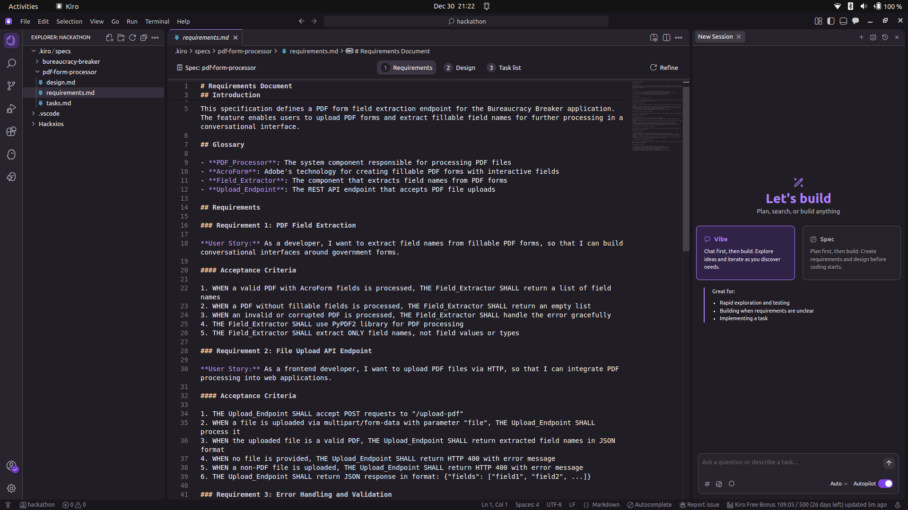
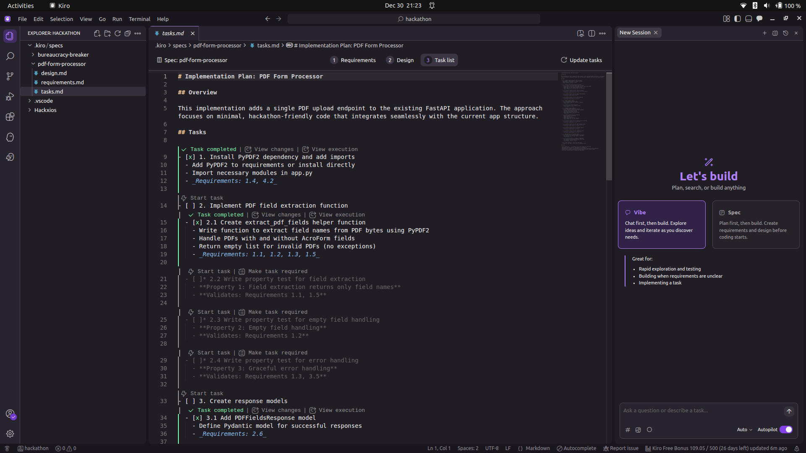
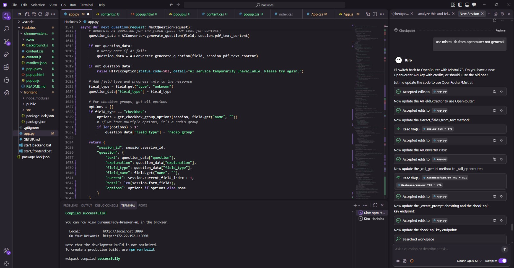
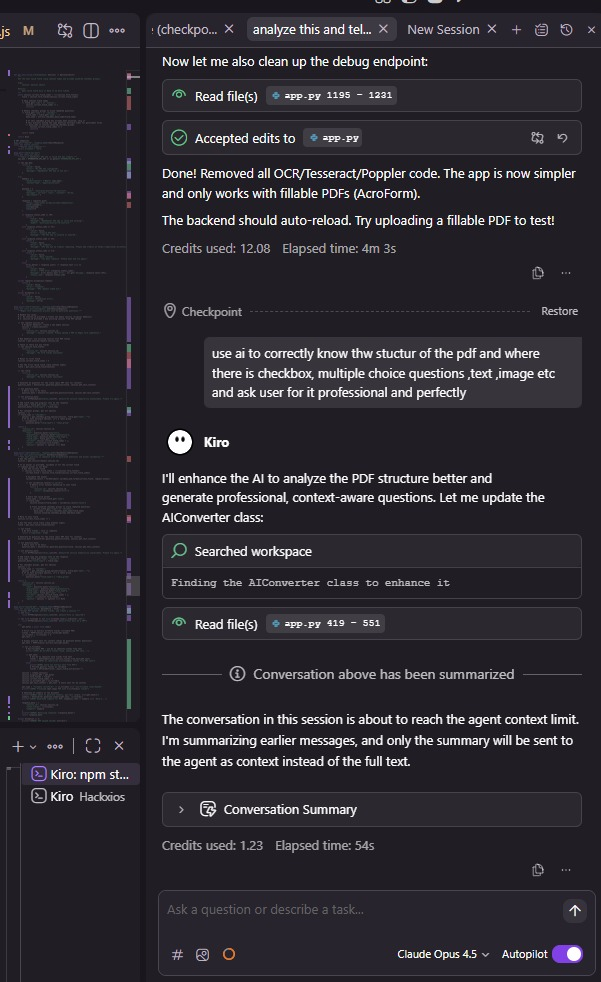
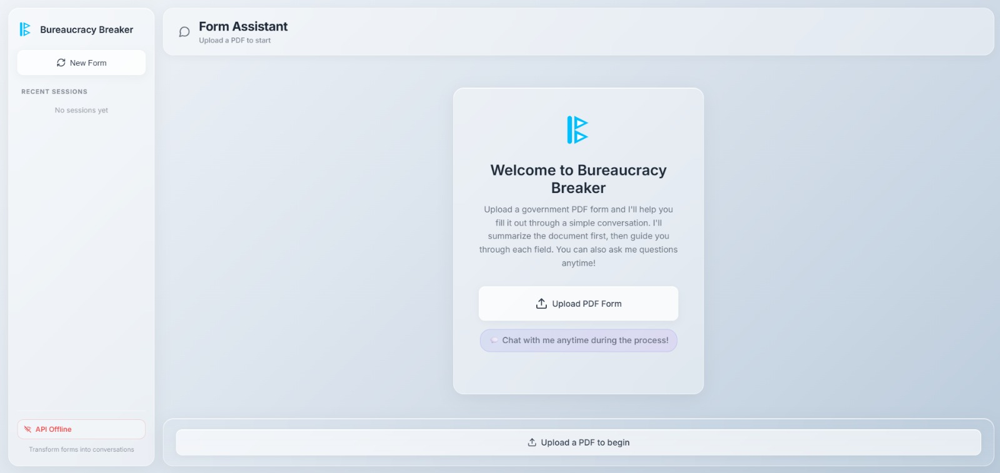
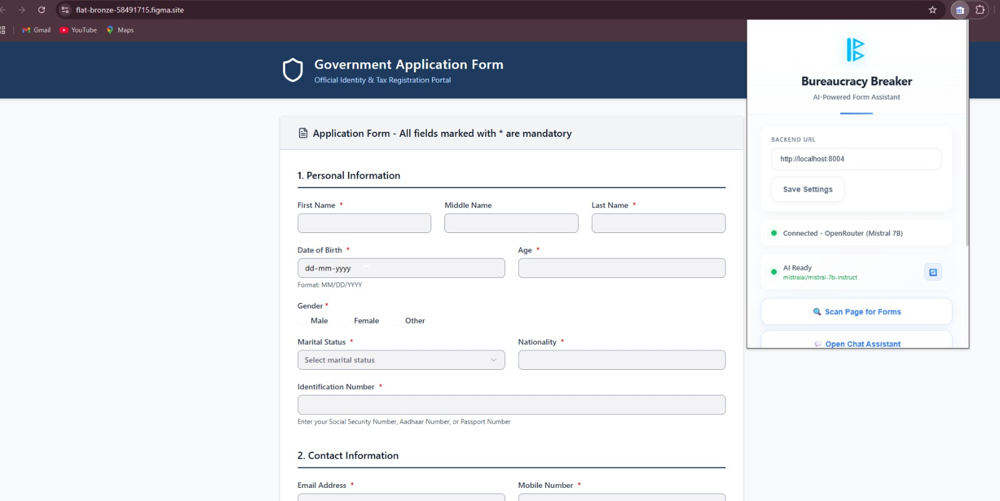
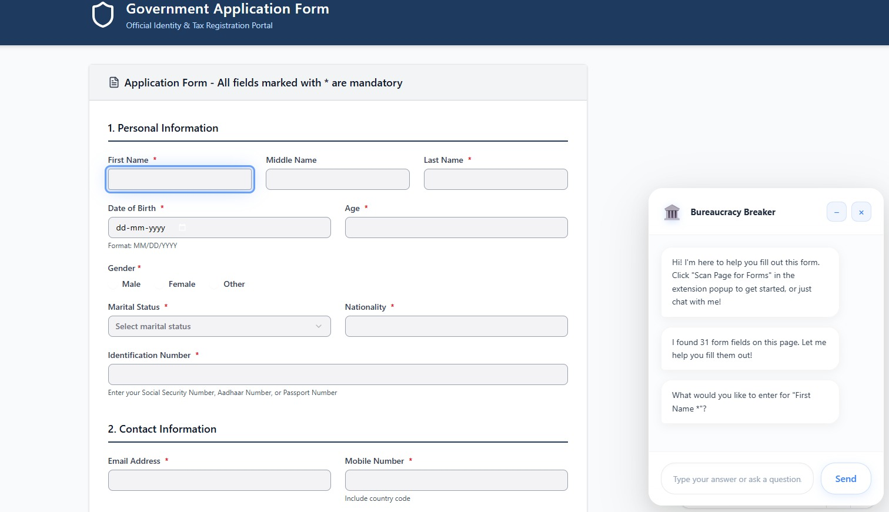

# Kiro Usage Log

## Purpose of This Document

This document provides clear evidence of how Kiro was used during the planning, design, and execution of the Bureaucracy Breaker project.

It serves as proof of authentic and meaningful Kiro usage, as required for the AWS / Kiro prize track.

---

## When Kiro Was Used

Kiro was used across multiple stages of the project:

- At the start of development to formalize requirements and scope
- During the hackathon to refine architecture and AI behavior
- Throughout development to reason through edge cases and integration decisions

Kiro usage was continuous during execution rather than limited to a single task.

---

## How Kiro Was Used

Kiro was used as a **thinking and planning partner**, not just a code generator.

Key areas where Kiro contributed include:
- Structuring project requirements and constraints
- Designing a safe, assistive system architecture
- Defining AI behavior and strict boundaries
- Reasoning through tricky form edge cases (e.g., checkbox groups, conditional fields)
- Organizing tasks and execution steps under time pressure

---

## Representative Kiro Prompts Used

The following prompts represent the type of structured reasoning and planning done inside Kiro during development.

These were used to clarify architecture, define AI behavior, and keep the system safe and realistic under hackathon constraints.

---

### Architecture Planning Prompt

We are building a browser extension that assists users while filling government forms.

How should the system be designed so that:
- The user logs in manually
- No CAPTCHA is bypassed
- No automatic submission happens
- AI does not directly interact with the browser DOM

Suggest a clean separation between browser extension, frontend UI, and backend logic that is safe and explainable.

---

### AI Behavior and Prompt Design Prompt

Define an AI persona that behaves like a calm government clerk.

The AI should:
- Explain each form field in plain English
- Ask only one question at a time
- Avoid legal guarantees or advice
- Help users understand where to find required information
- Never assume or auto-fill missing data

Provide guidance on how the AI should respond if the user says they are confused or unsure.

---

### Scope and Tradeoff Reasoning Prompt

Government forms often include scanned PDFs, CAPTCHA challenges, and complex layouts.

Under a 24-hour hackathon constraint:
- What are the risks of supporting OCR and full automation?
- Which features should be explicitly excluded to keep the system reliable?
- How can we demonstrate meaningful value without overengineering?

Recommend a safe and realistic scope for a hackathon prototype.

---

These prompts helped guide architectural decisions, AI constraints, and scope boundaries throughout development.

---

## Screenshots from Kiro IDE and Related Artifacts

The following screenshots were taken during development and planning using Kiro and related tooling.  
They demonstrate real usage of Kiro for structuring requirements, reasoning through logic, and coordinating execution.

---

### Requirements and Planning in Kiro

This screenshot shows requirement definition and early structuring of the project inside Kiro.

---

### Task Breakdown and Execution Planning

This screenshot captures task-level planning and coordination performed using Kiro during development.

---

### Code Reasoning and Snippet Review

This screenshot shows Kiro being used to reason about code structure and logic during development and debugging.

---

### Prompt Iteration and AI Reasoning

This screenshot reflects iterative prompt design and reasoning around AI behavior and constraints using Kiro’s chat interface.

---

### UI Integration Screens

The following screenshots show the evolving user interface that resulted from the planning and decisions captured in Kiro.

#### Chat and Assistance UI

#### Form Interaction and Autofill Flow

#### End-to-End Assistance View

These UI screens demonstrate how planning decisions translated into a working, user-facing system.

*(Screenshots demonstrate authentic use of Kiro for planning, task organization, and reasoning.)*

---

## Impact of Kiro on the Final System

Using Kiro directly influenced several core decisions in Bureaucracy Breaker:

- Clear separation between browser extension, frontend, and backend
- Assistive design instead of risky automation
- Field-by-field AI reasoning instead of whole-form processing
- Strong emphasis on security, ethics, and user control
- Conscious exclusion of OCR and CAPTCHA handling in v1

These outcomes are reflected consistently across the `/kiro/` documentation and the implemented system.

---

## Summary

Kiro functioned as a technical co-pilot during development.

It helped structure execution, validate design decisions, and maintain engineering discipline under hackathon pressure, resulting in a system that is reliable, explainable, and demo-ready.
